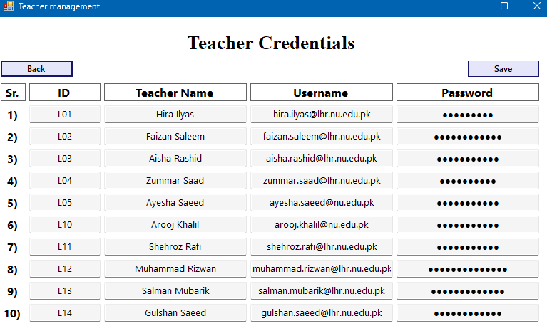

# MINIATURE STUDENT PORTAL

## About The Project
> MSP aims to replicate a Student portal for a single semester of a single department.
> The main structure is based on [NUCES FAST's flex student portal](https://flexstudent.nu.edu.pk).
> The program utilizes C++/CLR (WinForm) for its Graphical interface.

## Getting Started
> Download the MSP executable file from the [releases](https://GitHub.com/Yilliee/MSP/releases).
> Place it a new folder, and run it.
> The default password when no Admin Credentials can be found is:
> Username: `admin`
> Password: `admin`

## Features
```
- Add up to 3 administrators
- Add upto 10 teachers
- Create upto 10 sections
- Enroll upto 50 students per section
- Add up to 5 subjects per section
- Choose between Relative or Absolute grading for each subject individually
- Allot upto 5 subjects to a teacher
- Allow each user to reset their own password
- Create upto 10 Quizzes and Assignments for each section
- Allow the teacher to enter Marks of a student
- Allow the teacher to mark attendance of a student
- Allow the teacher to view a class's marks summary and choose when to enable grading for that subject.
- Allow a student to view his personal details
- Allow a student to view his Marks
- Allow a student to view his Grade ( if enabled )
```

## [Latest Release](https://github.com/Yilliee/MSP/releases/latest)

## Screenshots





")

")


